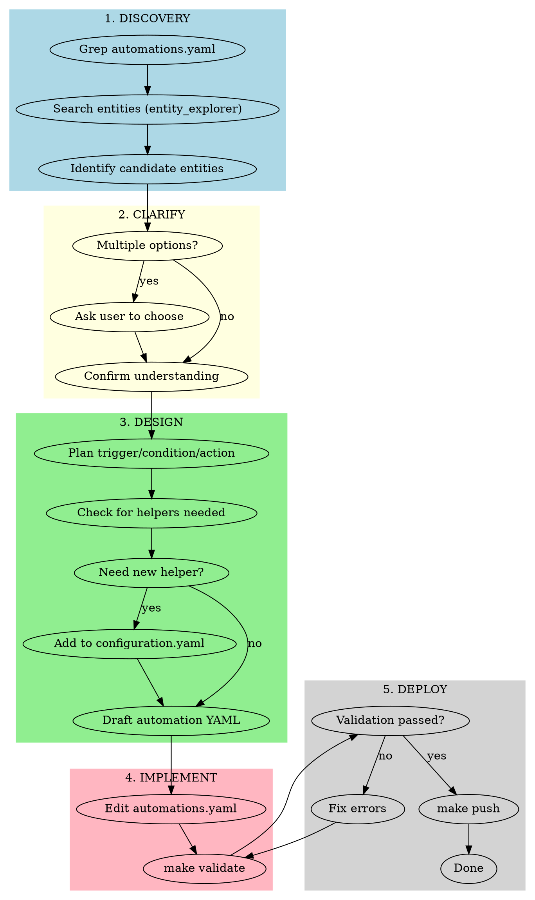

# Home Assistant Automation Creation

## Overview

Structured workflow for creating and modifying Home Assistant automations with entity validation, user clarification, and safe deployment.

## CRITICAL: Context Management

**Large files that will exhaust context if read fully:**
- `config/.storage/core.entity_registry` - 90k+ lines - **NEVER read directly**
- `config/.storage/core.device_registry` - 7k+ lines - **NEVER read directly**
- `config/automations.yaml` - 1600+ lines - **Use Grep to find specific automations**

**Always use targeted searches:**
- Use `Grep` with specific keywords, not `Read` on large files
- Use `python tools/entity_explorer.py --search "keyword"` for entity lookups
- When reading automations.yaml, use `Grep` to find the specific automation first, then `Read` with line offsets

## When to Use

- Creating new automations
- Modifying existing automations
- Adding new triggers/conditions/actions
- Troubleshooting automation issues
- User asks to "add an automation" or "make something happen when..."

**When NOT to use:**
- Simple entity lookups (use entity_explorer directly)
- Dashboard-only changes (no automation involved)
- Integration setup (configuration.yaml changes)

## Workflow



## Quick Reference

| Phase | Tools/Commands | Purpose |
|-------|----------------|---------|
| Discovery | `Grep`, `entity_explorer.py` | Find entities, existing automations |
| Clarify | `AskUserQuestion` | Resolve ambiguity, confirm intent |
| Design | `Read configuration.yaml` | Check helpers (small file, safe to read) |
| Implement | `Edit` | Modify YAML files |
| Deploy | `make validate`, `make push` | Test and deploy |

## Phase 1: Discovery

**Always start here.** Before writing ANY automation:

```bash
# 1. Find similar automations by keyword (DO NOT read entire file)
Grep "motion" config/automations.yaml  # Find automations mentioning "motion"
Grep "- id:" config/automations.yaml   # List all automation IDs

# 2. Use entity explorer for entity lookups (preferred method)
source venv/bin/activate && python tools/entity_explorer.py --search "bathroom"
source venv/bin/activate && python tools/entity_explorer.py --domain light

# 3. For specific entity validation, use targeted Grep
Grep "bathroom_motion" config/.storage/core.entity_registry
```

**DO NOT read these files directly (too large):**
- `config/.storage/core.entity_registry` - Use entity_explorer or Grep
- `config/.storage/core.device_registry` - Use Grep with device name
- `config/automations.yaml` - Use Grep to find specific sections first

**Safe to read directly:**
- `config/configuration.yaml` - Small, contains helpers/integrations

**Entity naming convention:** `location_room_device_sensor`
- Example: `binary_sensor.home_basement_motion_battery`

## Phase 2: Clarify

**ALWAYS ask when:**
- Multiple sensors could work (which motion sensor?)
- Multiple locations involved (which room?)
- Timing is ambiguous (day only? always?)
- Behavior has options (toggle vs always-on?)

**Example clarification questions:**
- "I found 3 motion sensors in the basement. Which should trigger this?"
- "Should this run only during certain hours?"
- "What automation mode: single (ignore new triggers) or restart?"

**DO NOT assume.** Even if one option seems obvious, confirm with user.

## Phase 3: Design

### Automation Structure

```yaml
- id: unique_snake_case_id
  alias: Human-Readable Name
  description: What this automation does
  triggers:
    - trigger: state|device|time|numeric_state|sun|event|zone
      # trigger-specific fields
  conditions:
    - condition: state|numeric_state|time|template
      # condition-specific fields
  actions:
    - action: domain.service
      target:
        entity_id: entity.id
      data: {}
  mode: single|queued|restart|parallel
```

### Common Patterns

**Motion-activated with timer:**
```yaml
triggers:
  - trigger: state
    entity_id: binary_sensor.room_motion
    to: 'on'
actions:
  - action: light.turn_on
    target:
      entity_id: light.room
  - action: timer.start
    target:
      entity_id: timer.room_timer
```

**Multi-trigger with choose:**
```yaml
triggers:
  - trigger: device
    device_id: xxx
    subtype: single
    id: single_press
  - trigger: device
    device_id: xxx
    subtype: double
    id: double_press
actions:
  - choose:
    - conditions:
      - condition: trigger
        id: single_press
      sequence:
        - action: light.toggle
    - conditions:
      - condition: trigger
        id: double_press
      sequence:
        - action: scene.turn_on
```

**Toggle-gated automation:**
```yaml
conditions:
  - condition: state
    entity_id: input_boolean.feature_toggle
    state: 'on'
```

### Helper Entities

If automation needs state tracking, add helpers to `configuration.yaml`:

```yaml
input_boolean:
  feature_toggle:
    name: Feature Toggle
    icon: mdi:toggle-switch

timer:
  room_timer:
    name: Room Timer
    duration: "00:10:00"
```

**Note:** New helpers require "Reload all YAML configuration" in HA to appear.

## Phase 4: Implement

**Rules for editing:**
1. Make focused, targeted edits (not wholesale rewrites)
2. Preserve existing automation IDs
3. Use exact string matching for Edit tool
4. One logical change per edit when possible

**Validation runs automatically** via post-edit hooks. Watch for errors.

## Phase 5: Deploy

```bash
# Validate all changes
make validate

# If validation passes, deploy
make push
```

**Validation checks:**
- YAML syntax
- Entity reference existence
- Device ID validity
- Official HA configuration validation

## Common Mistakes

| Mistake | Fix |
|---------|-----|
| Reading entire entity_registry (90k lines) | Use `entity_explorer.py` or `Grep` |
| Reading entire automations.yaml | Use `Grep` to find specific sections |
| Using entity without verifying existence | Use entity_explorer to validate |
| Assuming which sensor to use | Ask user when multiple options |
| Large wholesale file rewrites | Use targeted Edit calls |
| Skipping validation | Always run `make validate` |
| Not checking for needed helpers | Review if timers/toggles needed |

## Red Flags - You're Doing It Wrong

- **Reading entire entity_registry or device_registry** - Use Grep/entity_explorer
- **Reading entire automations.yaml** - Use Grep to find specific automations first
- Writing automation without searching automations.yaml first
- Assuming entity exists without verification
- Not asking when multiple sensors/devices could work
- Pushing without validation
- Adding helpers without mentioning reload requirement

**All of these mean: Go back to Phase 1 and follow the workflow.**

## Trigger Types Quick Reference

| Type | Use For | Key Fields |
|------|---------|------------|
| `state` | Entity state changes | `entity_id`, `to`, `from` |
| `numeric_state` | Thresholds | `entity_id`, `above`, `below` |
| `device` | Buttons, physical events | `device_id`, `type`, `subtype` |
| `time` | Scheduled | `at` |
| `time_pattern` | Recurring | `hours`, `minutes`, `seconds` |
| `sun` | Sunrise/sunset | `event`, `offset` |
| `event` | HA events | `event_type`, `event_data` |
| `zone` | Location | `entity_id`, `zone`, `event` |

## Automation Modes

| Mode | When to Use |
|------|-------------|
| `single` | Default - ignore triggers while running |
| `queued` | Process all triggers in order |
| `restart` | Cancel current, start fresh on new trigger |
| `parallel` | Run multiple instances simultaneously |

## Finding Entity/Device IDs

```bash
# PREFERRED: Use entity explorer (formatted output, context-efficient)
source venv/bin/activate && python tools/entity_explorer.py --search "bathroom"
source venv/bin/activate && python tools/entity_explorer.py --domain binary_sensor

# For device IDs (device triggers), search by device name
Grep "Bathroom Button" config/.storage/core.device_registry

# Validate specific entity exists
Grep "bathroom_motion" config/.storage/core.entity_registry
```

**Never read registry files directly - always use Grep or entity_explorer.**
