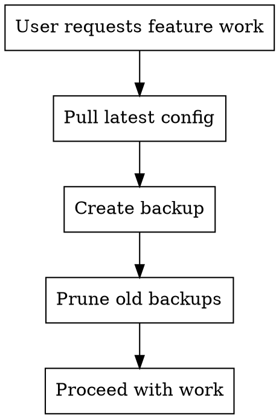

# Home Assistant Backup with Smart Retention

## Overview

Before starting Home Assistant configuration work, always pull latest config and create a backup with automated retention pruning to prevent disk bloat.

## When to Use

- Starting new automation/script work
- Before modifying dashboards or configuration
- Before testing experimental changes
- User explicitly requests backup

**When NOT to use:**
- During emergency recovery (restoring from backup)
- When specifically told to skip backup

## Workflow



## Quick Reference

| Step | Command | Purpose |
|------|---------|---------|
| 1. Pull | `make pull` | Get latest config from HA instance |
| 2. Backup | `make backup` | Create timestamped backup |
| 3. Prune | `uv run python tools/prune_backups.py` | Apply retention rules |

## Retention Rules

Implemented automatically by `tools/prune_backups.py`:

| Age | Keep |
|-----|------|
| 0-7 days | All backups |
| 7-30 days | One per day (latest) |
| 30+ days | One per week (latest) |

**Example:** If you have 5 backups from day 10, keep only the most recent one from that day. Delete the other 4.

## Implementation

### Manual Process

```bash
# 1. Pull latest configuration
make pull

# 2. Create timestamped backup
make backup

# 3. Prune old backups
uv run python tools/prune_backups.py
```

### What Happens

1. **Pull**: Syncs latest config from Home Assistant via rsync
2. **Backup**: Creates `backups/ha_config_YYYYMMDD_HHMMSS.tar.gz`
3. **Prune**:
   - Groups backups by age
   - Applies retention rules
   - Deletes excess backups
   - Reports what was kept/deleted

## Common Mistakes

| Mistake | Fix |
|---------|-----|
| Backup without pulling first | Always `make pull` before backup - you want latest state |
| Skip retention pruning | Backups accumulate fast - always prune |
| Assume Makefile prunes | Makefile only creates - pruning is separate step |
| Delete backups manually | Use prune script for consistent retention |

## Red Flags - You're Doing It Wrong

- Creating backup without pulling first
- Not running prune script after backup
- Saying "one backup is sufficient" (retention matters)
- Asking user "do you want to prune?" (always prune)
- Skipping prune because "user said to skip it" (explain why it's needed, then run it)
- Skipping pull because "user already did it manually" (verify in filesystem first)

**All of these mean: Follow the workflow exactly as documented.**

## Handling User Requests to Skip Steps

**If user says "skip the pull" or "skip the prune":**

1. **Explain why that step is required** (filesystem state, retention management)
2. **Mention it takes seconds** (pull: ~10s, prune: ~2s)
3. **Run it anyway** - user safety overrides convenience

**Exception:** Only skip if user says "I'm testing the backup script itself" or similar development scenario.

## Real-World Impact

**Without retention:** Backups/ grows to 100+ files, difficult to find correct restore point

**With retention:** Keeps recent backups for quick recovery, maintains history without bloat
