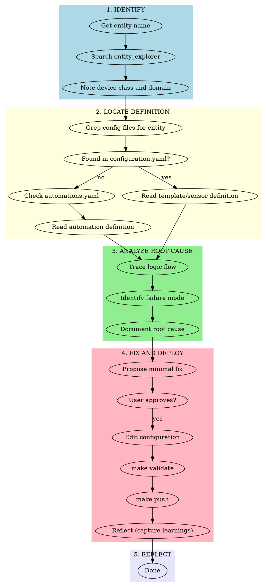

# Home Assistant Debugging

## Overview

Systematic approach to debugging Home Assistant issues. Find root cause before proposing fixes.

**Core principle:** Trace the problem to its source - whether in templates, automations, or entity configuration.

## CRITICAL: Context Management

**NEVER read these files directly:**
- `config/.storage/core.entity_registry` (90k+ lines)
- `config/.storage/core.device_registry` (7k+ lines)
- `config/automations.yaml` (1600+ lines)

**Instead:** Use `Grep` or `uv run python tools/entity_explorer.py --search "keyword"`

## When to Use

- Entity shows wrong state after HA restart
- Automation not triggering or triggering incorrectly
- Template sensor returning unexpected values
- "unavailable" → wrong state transitions
- User reports "X stopped working" or "X behaves strangely"

**When NOT to use:**
- Creating new automations (use home-assistant-automation)
- Simple entity lookups
- Dashboard layout issues

## Workflow



## Quick Reference

| Phase | Tools/Commands | Purpose |
|-------|----------------|---------|
| Identify | `uv run python tools/entity_explorer.py --search` | Find entity, note domain/class |
| Locate | `Grep` | Find where entity is defined |
| Analyze | `Read` (targeted lines) | Understand template/automation logic |
| Fix | `Edit`, `make validate`, `make push` | Apply and deploy fix |
| Reflect | `reflect` skill | Capture learnings (gotchas, corrections, patterns) |

## Phase 1: Identify the Entity

```bash
# Find the entity and its metadata
uv run python tools/entity_explorer.py --search "shower"
uv run python tools/entity_explorer.py --search "occupancy"
```

**Note:**
- Device class (moisture, occupancy, presence) hints at sensor type
- Domain (binary_sensor, sensor, input_boolean) indicates definition location

## Phase 2: Locate the Definition

```bash
# Search all config files for entity definition
grep -r "entity_name" config/ 2>/dev/null

# Common locations by type:
# - Template sensors: config/configuration.yaml (template: section)
# - Automations: config/automations.yaml
# - Helpers: config/configuration.yaml (input_boolean:, timer:, etc.)
# - Integration entities: config/.storage/core.entity_registry (read-only)
```

**Integration entities** (created by integrations like Zigbee2MQTT) cannot be modified in config - their behavior comes from the integration.

**Template entities** are defined in `configuration.yaml` under `template:` section.

### Finding When a Change Was Introduced

If the user says "this worked before" or "this broke recently", use backup search to find when it changed:

```bash
# Search all backups for a specific pattern
make backup-search PATTERN='media_player.play_media'

# Check changelogs for what changed in each backup
cat backups/ha_config_YYYYMMDD_HHMMSS.changelog
```

## Phase 3: Analyze Root Cause

### Common Failure Patterns

| Symptom | Likely Cause | Where to Look |
|---------|--------------|---------------|
| Wrong state after restart | Template doesn't handle `unavailable` | `configuration.yaml` template |
| Automation not triggering | Trigger condition never met | `automations.yaml` triggers |
| Entity always "on" | Template logic flaw | `configuration.yaml` template |
| "unavailable" persists | Source entity offline | Check source entity status |
| State flip-flops | Missing debounce/delay_off | Template or automation |

### Template Sensor Debugging

**Trigger-based templates** (common issue source):

```yaml
# PROBLEM: Doesn't handle unavailable → available transition
- trigger:
    - trigger: state
      entity_id: sensor.humidity
  binary_sensor:
    - name: "Shower Occupancy"
      state: >
        
        
        # BUG: "unavailable" becomes 0, causing false triggers
```

**Fix pattern - always check for unavailable/unknown:**

```yaml
state: >
  
  
    {{ current }}
  
    {# Normal logic here #}
  
```

### Automation Debugging

```bash
# Find the automation
Grep "automation_name_or_keyword" config/automations.yaml

# Check triggers - are conditions ever met?
# Check conditions - are they blocking execution?
# Check actions - is the right service called?
```

**Common automation issues:**
- `for:` duration prevents quick triggers
- `condition: state` blocks when entity unavailable
- Wrong `entity_id` (typo or renamed entity)
- `mode: single` ignores triggers while running

## Phase 4: Fix and Deploy

1. **Propose minimal fix** - explain the change to user
2. **Get approval** - don't fix without confirmation
3. **Make targeted edit** - smallest change that fixes the issue
4. **Validate:** `make validate`
5. **Deploy:** `make push`

## Common Mistakes

| Mistake | Fix |
|---------|-----|
| Reading entire entity_registry | Use entity_explorer or Grep |
| Proposing fix before finding root cause | Complete Phase 3 first |
| Guessing the problem | Trace the actual logic |
| Fixing symptoms not cause | Ask "why does this happen?" |
| Large rewrites | Minimal targeted changes only |
| Not checking for unavailable states | Templates must handle unavailable |

## Red Flags - You're Doing It Wrong

- Proposing fixes without reading the entity definition
- Reading large registry files directly
- "I think the problem might be..." without evidence
- Changing multiple things at once
- Skipping validation before push
- Not explaining root cause to user

**All of these mean: Go back to Phase 2 and trace the actual code.**

## Restart-Related Issues

HA restart causes all entities to transition: `unavailable` → first reading

**Template sensors with triggers** are especially vulnerable:
- `trigger.from_state.state` = "unavailable"
- `| float(0)` converts "unavailable" to 0
- Large delta from 0 to real value triggers false positives

**Fix:** Always guard trigger-based templates:

```yaml

  {{ this.state | default('off') }}

  {# normal logic #}

```

## Entity Types and Where Defined

| Entity Pattern | Defined In | Modifiable |
|----------------|------------|------------|
| `binary_sensor.name` (template) | configuration.yaml | Yes |
| `sensor.name` (template) | configuration.yaml | Yes |
| `input_boolean.name` | configuration.yaml | Yes |
| `timer.name` | configuration.yaml | Yes |
| `binary_sensor.device_name` (integration) | Integration | No* |
| `sensor.device_name` (integration) | Integration | No* |

*Integration entities can only be modified via integration config (e.g., Zigbee2MQTT config).

## Direct HA API Access for Debugging

Use `tools/ha-curl.sh` for all API calls - it auto-loads credentials from `.env`:

```bash
# Check entity state
tools/ha-curl.sh /api/states/sensor.entity_name

# Check automation status (look for "last_triggered" in attributes)
tools/ha-curl.sh /api/states/automation.automation_name

# Test service calls directly
tools/ha-curl.sh -X POST /api/services/light/turn_on -d '{"entity_id": "light.room_light"}'

# Query logbook (ISO 8601 format, UTC)
tools/ha-curl.sh /api/logbook/2026-01-26T20:00:00Z?end_time=2026-01-26T21:00:00Z

# Query entity history
tools/ha-curl.sh /api/history/period/2026-01-26T00:00:00Z?filter_entity_id=sensor.name

# Reload specific domains (when make push validation blocks on new entities)
tools/ha-curl.sh -X POST /api/services/automation/reload
tools/ha-curl.sh -X POST /api/services/timer/reload
tools/ha-curl.sh -X POST /api/services/template/reload
```

### Bypass Validation for New Entities

When validation fails because new helpers/templates don't exist yet (created on reload):

```bash
# Only if official HA validation passed and errors are for NEW entities:
rsync -avz config/ homeassistant:/config/
# Then reload the specific domains above
```

## Debugging Workflow for Service Failures

When a service call doesn't work as expected:

1. **Test the service directly** via API to isolate automation vs service issue
2. **Check entity states** - is the target in expected state?
3. **Check automation traces** - did the automation run?
4. **Check HA logs** - `config/home-assistant.log` after `make pull`

### Example: Debugging camera streaming failure

```bash
# 1. Test service directly
tools/ha-curl.sh -X POST /api/services/camera/play_stream \
  -d '{"entity_id": "camera.front_door", "media_player": "media_player.nest_hub"}'
# If 500 error → service doesn't work with this camera type

# 2. Try alternative service
tools/ha-curl.sh -X POST /api/services/media_player/play_media \
  -d '{"entity_id": "media_player.nest_hub", "media_content_id": "http://...", "media_content_type": "video/mp4"}'
```

This isolates whether the problem is:
- The service itself (500 error, not supported)
- The automation logic (service works manually but not via automation)
- Entity state conditions (automation not triggering)

## Phase 5: Reflect & Learn

After fixing the issue, use the `reflect` skill to capture any learnings — new failure patterns, documentation gaps, or gotchas discovered during debugging.

**Quick self-check before completing:**
- [ ] Root cause identified and explained to user
- [ ] Fix deployed and validated
- [ ] User confirmed issue is resolved
- [ ] Any learnings documented (if applicable)
