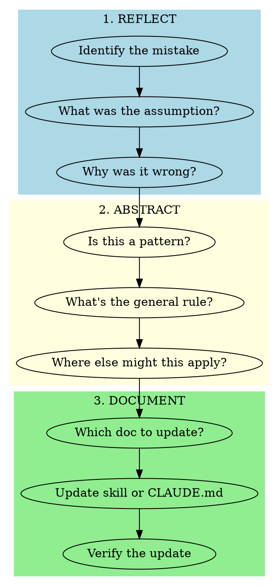

# Learning from Mistakes

## Overview

When a mistake is identified, use this structured process to extract lasting value from it. The goal is not just to fix the immediate issue, but to prevent similar mistakes in the future through documentation.

**Core principle:** Every mistake is an opportunity to improve the system. Abstract the specific error into a general pattern that can be documented.

## When to Use

- After catching an error in your own work
- When user points out a mistake you made
- After a failed deployment or validation
- When you realize an assumption was wrong
- When a better approach becomes apparent after the fact

**When NOT to use:**
- Trivial typos with no pattern to learn
- External failures (network, API) outside our control
- User changed requirements mid-task (not a mistake)

## Workflow



## Quick Reference

| Phase | Key Questions | Output |
|-------|--------------|--------|
| Reflect | What happened? What assumption failed? | Root cause statement |
| Abstract | Is this a pattern? What's the general rule? | Generalized learning |
| Document | Where should this live? | Updated skill or CLAUDE.md |

## Phase 1: Reflect

Answer these questions honestly:

1. **What exactly happened?**
   - Describe the specific mistake
   - What was the expected vs actual outcome?

2. **What assumption was wrong?**
   - What did I believe that turned out to be false?
   - Why did I hold that belief?

3. **When did the mistake occur?**
   - Planning phase? Implementation? Testing?
   - Could it have been caught earlier?

4. **What was the impact?**
   - Time wasted? Broken deployment? User frustration?
   - Severity helps prioritize documentation effort

## Phase 2: Abstract

Transform the specific mistake into a general lesson:

1. **Is this a pattern?**
   - Have I made this mistake before?
   - Would other developers make this mistake?
   - Is this specific to this project or universal?

2. **What's the general rule?**
   - Express the learning as a principle
   - Example: "Always check X before doing Y"
   - Example: "Never assume X without verifying"

3. **Where else might this apply?**
   - Other workflows in this project?
   - Other skills that should mention this?
   - General development practices?

## Phase 3: Document

Decide where the learning should live:

| Learning Type | Where to Document |
|--------------|-------------------|
| Workflow-specific | Add to relevant skill's "Common Mistakes" or "Red Flags" |
| Project-wide practice | Add to CLAUDE.md |
| Tool-specific | Add to relevant skill's usage section |
| New process needed | Consider creating a new skill |

### Update Format

**For skills (Common Mistakes table):**
```markdown
| Mistake | Fix |
|---------|-----|
| [What went wrong] | [What to do instead] |
```

**For skills (Red Flags section):**
```markdown
- [Pattern that indicates you're about to make this mistake]
```

**For CLAUDE.md:**
```markdown
## Section Name
- **[Topic]**: [Brief guidance on avoiding the mistake]
```

## Common Mistakes

| Mistake | Fix |
|---------|-----|
| Superficial reflection ("I made an error") | Ask "why" at least 3 times to find root cause |
| Too specific (only fixes this instance) | Abstract to pattern that prevents future occurrences |
| Documenting without verifying | Re-read the update - would it have prevented the original mistake? |
| Updating wrong document | Match learning type to documentation location |
| Skipping documentation | The same mistake will happen again - always document |

## Red Flags - You're Doing It Wrong

- Moving on without documenting the learning
- Writing documentation that doesn't address root cause
- Vague updates like "be more careful"
- Not identifying the failed assumption
- Documenting in a place no one will see
- Treating reflection as blame rather than improvement

## Example Reflection

**Mistake:** Read entire entity_registry file (90k lines), exhausting context.

**Reflection:**
1. What happened? Read large file directly instead of using search tools
2. What assumption failed? Assumed file was small enough to read
3. When? Implementation phase - should have checked file size

**Abstraction:**
1. Pattern? Yes - large files exist in this project
2. General rule: "Check file size or use search tools before reading storage files"
3. Where else? Any skill that might read config files

**Documentation:**
- Updated home-assistant-debugging skill with context management section
- Added file size warnings to CLAUDE.md
- Listed specific large files to avoid reading directly

## Verification

After documenting, ask:
- If I encountered this situation again, would I find this guidance?
- Is the guidance specific enough to be actionable?
- Does it explain WHY, not just WHAT?
