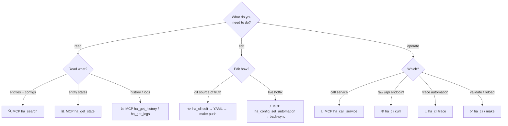

# Home Assistant Configuration Management

This repository manages Home Assistant configuration files with automated validation, testing, and deployment.

> **Note:** `AGENTS.md` is the harness-agnostic source of truth, read by opencode, Cursor, Aider, and other tools.

## User Preferences

- **Timezone:** AEST/AEDT (Australian Eastern). AEST=UTC+10, AEDT=UTC+11 (Oct-Apr). "7:15am AEDT" = 20:15 UTC previous day.

## Project Structure

### HA Configuration Files
- `config/automations.yaml` — **Primary file for automation work** (use `ha_cli edit automations` or MCP tools)
- `config/scripts.yaml`, `config/scenes.yaml`, `config/configuration.yaml`
- `config/blueprints/` — HA blueprints (automation/, script/, template/)
- `config/.storage/core.entity_registry` — **1.7MB JSON, never read directly.** Use `ha_search` MCP tool or `grep` for known exact IDs.
- `frigate/config.yml` — Frigate NVR (addon: `ccab4aaf_frigate-fa-beta`)

### Tools Package (`tools/`)
- `tools/ha_cli.py` — **Single CLI entry point**
- `tools/commands/` — Subcommands: curl, edit, reload, stale-sensors, trace, validate
- `tools/ha/client.py` — `HAClient` (importable REST API client)
- `tools/ha/yaml_editor.py` — `YAMLEditor` (importable round-trip YAML)
- `tools/validators/` — Validators: `base.py`, `duplicate_ids.py`, `entity_definitions.py`, `ha_official.py`, `references.py`, `services.py`, `stale_sensors.py`, `templates.py`, `yaml.py`
- `tools/cache.py`, `tools/common.py` — Caching; shared utilities (`common.py` re-exports from `validators/base.py`, defines `positive_int`/`non_negative_int` argparse types)
- `tools/output_shape.py` — Shared JSON output-shaping (`apply_output_shape()` for --first/--pick/--max-chars)
- `tools/_dev/api_diagnostic.py` — Dev-only (archived, excluded from lint/wheel)
- `tests/conftest.py` — Shared fixtures (`config_dir`, `_stub_load_env_file`)

## Environment Setup

Configure `.env` (copy from `.env.example`): `HA_TOKEN`, `HA_URL`, `HA_HOST`, `HA_MCP_URL`

## Commands

```
make pull           Sync config from HA
make push           Push config (with validation)
make backup         Timestamped backup (auto-changelog)
make validate       Run all validators
make reload         Reload HA config via API
make status         Config status + validation summary
make lint / lint-fix    Ruff format + check, mypy type check
make test-ssh       Test SSH connection
make clean          Remove temp/cache
```

CLI: `uv run python tools/ha_cli.py {validate|reload|curl|edit|stale-sensors|trace}`
Flags: `--summary` (compact output, auto for agents/pipes), `--no-summary` (force verbose), `--force` (bypass cache)

### HA API Access — Pick ONE per task (don't double-call)

`ha_cli` and `ha-mcp` overlap on a few functions. Calling both for the same task
doubles latency (~200ms Python-startup per `ha_cli` call) and tokens.

| Task | Use | One-line reason |
|------|-----|-----------------|
| Discover entities **and/or** existing automation/script/scene/helper configs | **MCP `ha_search`** | One call covers registry + config bodies. |
| Read one/many entity states | **MCP `ha_get_state`** | Leanest payload, bulk up to 100, no Python startup. |
| Arbitrary `/api/...` REST endpoint | **`ha_cli curl`** | Escape hatch — MCP has no raw-REST tool. |
| Call a service | **MCP `ha_call_service`** | No startup overhead. |
| Entity history (raw) | **MCP `ha_get_history`** | Also offers `source="statistics"` for long-term data. |
| System/logbook/addon/supervisor logs | **MCP `ha_get_logs`** | 6 sources + filtering. |
| Trace a **specific** automation | **MCP `ha_get_automation_traces`** or `ha_cli trace <id>` | Either works.
| List traces across **all** automations | **`ha_cli trace`** (no arg) | MCP requires an `automation_id`. |
| **Edit automations/scripts** (git source of truth) | **`ha_cli edit`** | Writes local YAML → `make push`. MCP `ha_config_set_automation` writes **live HA, bypasses git** — next `make pull` overwrites it. |
| Live/hotfix automation edit | MCP `ha_config_set_automation` | Then back-sync to YAML. |
| Validate / stale-sensors / reload | **`ha_cli` / `make`** | No MCP equivalent — these are local-file/Makefile operations. |

**Golden rule:** discovery + state reads → **MCP**; edits + validation + deploy
→ **`ha_cli`**. Programmatic access: `from tools.ha.client import HAClient`.



### ha_cli curl
```bash
uv run python tools/ha_cli.py curl /api/states              # compact JSON (guardrail: count+hint in pipe)
uv run python tools/ha_cli.py curl /api/states --pretty     # human-readable
uv run python tools/ha_cli.py curl /api/states --count      # item count
uv run python tools/ha_cli.py curl /api/states --keys       # key names only
uv run python tools/ha_cli.py curl /api/states --first 3    # first N items
uv run python tools/ha_cli.py curl /api/states --pick state,entity_id  # keep only those keys
uv run python tools/ha_cli.py curl /api/states --entity sensor.temp   # single entity fetch
uv run python tools/ha_cli.py curl /api/states --domain light --pick state  # filter by domain
uv run python tools/ha_cli.py curl /api/states --max-chars 500       # truncate output when >500 chars
uv run python tools/ha_cli.py curl /api/states --no-guard            # disable guardrail AND max-chars cap (dump all)
uv run python tools/ha_cli.py curl --post /api/services/light/turn_on -d '{"entity_id":"light.kitchen"}'
```

### ha_cli trace
```bash
uv run python tools/ha_cli.py trace                                   # list all automation traces (WebSocket)
uv run python tools/ha_cli.py trace automation.morning_routine        # specific automation trace
uv run python tools/ha_cli.py trace --first 5                         # first 5 traces only (after dedupe in summary)
uv run python tools/ha_cli.py trace automation.foo --pretty           # pretty-print trace
```
Summary mode dedupes by item_id (keeps most-recent run), adds `runs` field when N>1. Single-entity traces strip `config`/`blueprint_inputs` plus all nested `.attributes` from `changed_variables` entity-state dicts. `--max-chars` is now enforced on single-entity dicts by dropping the largest trace step keys (with `_truncated`/`dropped_steps`/`kept_steps` markers and stderr notice).

### Compact Output (--summary)

Auto-detected when stdout is not a TTY (agents, pipes). `--summary` forces on, `--no-summary` forces off.
Curl summary mode: suppresses informational stderr warnings (data-ignored, pretty-no-effect, overcount notes).

```
PASS YAML Syntax Validation C                                  RELOADED 4/4 (core, automations, scripts, scenes) 2.3s
PASS Service Reference Validation (0.27s)
FAIL Service Reference Validation (0.08s)                     PASS Entity/device references
  ERROR: config/automations.yaml: Unknown service 'light.missing'
PASSED 7/7 (9.69s)    FAILED 6/7 (5.02s)
```

### Validator Caching

SHA256-hash cache in `config/.cache/validators/<ClassName>.json`. Cache keys combine dependent-file content with the concrete validator and shared `ValidatorBase` implementation source. Unchanged files use cache; unreadable matched dependencies and malformed cache records are cache misses. `--force` re-runs all. Failures always re-run. Clear with `git clean -fdX config/.cache/`.

### YAML Editing (ha_cli edit)

**Prefer `ha_cli edit`** — round-trip YAML via `ruamel.yaml`, preserves comments/formatting.
Edit diagnostics distinguish a missing target (`file not found`), an execution-time
read failure (`could not read`), and invalid YAML (`could not parse`).
```bash
uv run python tools/ha_cli.py edit automations                  # list aliases
uv run python tools/ha_cli.py edit automations "Turn on Alarm"  # show one
uv run python tools/ha_cli.py edit automations --add '{"alias":"X","trigger":[],"action":[]}'
uv run python tools/ha_cli.py edit automations "X" --set mode=single  # update field
uv run python tools/ha_cli.py edit automations "X" --remove
```
Programmatic: `from tools.ha.yaml_editor import YAMLEditor`

### Importable Modules
```python
from tools.ha.client import HAClient        # HAClient.from_env()
from tools.ha.yaml_editor import YAMLEditor
from tools.output_shape import apply_output_shape  # --first/--pick/--max-chars
from tools.common import positive_int, non_negative_int        # argparse type validators
from tools.validators.references import ReferenceValidator
from tools.validators.services import ServiceValidator
from tools.validators.templates import TemplateValidator
from tools.validators.ha_official import HAOfficialValidator
from tools.validators.yaml import YAMLValidator
from tools.validators.duplicate_ids import DuplicateIDValidator
from tools.validators.base import ValidatorBase, HAYamlLoader
from tools.validators.entity_definitions import EntityDefinitionExtractor
```

### MCP Server (ha-mcp)

88+ MCP tools for natural-language HA control. `home-assistant-best-practices` skill triggers on automation/script/dashboard work.

**Setup:** Install addon from `https://github.com/homeassistant-ai/ha-mcp`, copy MCP URL from logs (`http://<ip>:9583/private_<token>`), set `HA_MCP_URL` in `.env`.

**Tool selection:** see the decision matrix above. MCP wins for discovery/state-reads/traces; `ha_cli` wins for edits/validation/deploy/raw-REST.

**Token tuning:** Disable unused directly-exposed tools per session via settings UI (URL from `ha_get_overview` → `settings_url`). Remaining tools discoverable via `ha_search_tools` + `ha_call_*` proxies.

## Development Workflow

- **Before work:** `home-assistant-backup` skill (pull → backup → prune)
- **Graphify freshness:** Before using graphify for any query, path, explain, or graph-backed analysis, run `graphify . --update --code-only` from the repository root. Treat `graphify-out/graph.json` as stale until that refresh completes; never use the existing-graph fast path without first updating it.
- **Automations:** `home-assistant-automation` skill; scripts/scenes: `home-assistant-best-practices` skill
- **Debugging:** `home-assistant-debugging` skill
- **Python changes:** **Always TDD** — write tests first, confirm red, then implement.
- **After tests pass:** update `README.md`, this context file (`AGENTS.md`), and relevant skills to reflect any behavior, entity, or workflow changes.
- **Before committing:** `make lint` (or `make lint-fix`; runs ruff + mypy)
- **After concurrency/parallel/error-handling changes:** `code-review:code-review` as "State Machine Auditor"
- **Rubber duck review:** invoke the `rubber-duck-review` skill when wanted (explicit, not automatic).
- **Before finishing:** `reflect` skill to capture learnings.

### Python Tooling Patterns

- **`contextlib.redirect_stdout` is NOT thread-safe** — mutates `sys.stdout` globally. For parallel validators, read `instance.errors`/`warnings`/`info` lists directly.
- **Removed backward-compat shims:** legacy `tools/*_validator.py` paths no longer exist. `test_shims_missing.py` asserts each raises `ImportError` — keep it updated when retiring compat layers.
- **`load_env_file()` in tests:** Overrides monkeypatched env vars. Patch `tools.ha.client.load_env_file` (and `tools.validators.stale_sensors.load_env_file` if testing stale sensors) to a no-op. The autouse `_stub_load_env_file` fixture in `tests/conftest.py` covers both.
- **`main()` returns `int`:** Validator/command `main()` returns 0 (pass) or 1 (fail). `__main__` blocks use `raise SystemExit(main())`.
- **Stream separation:** Results/summaries → stdout; diagnostics/errors/warnings/verbose → stderr. Tests assert `captured.out` vs `captured.err`.
- **`from __future__ import annotations` removed:** Python 3.14 lazy annotations are enabled by default — no longer needed.
- **Narrow `except`:** Prefer `except OSError` over bare `except Exception`. Check the specific error hierarchy before widening.
- **Subclass `__init__` kwarg forwarding:** Every subclass overriding `__init__` must accept+forward new kwargs (`quiet`, `summary`) via `super().__init__()`. Check ALL subclasses.
- **Python 3.14 `except A, B, C:`** is canonical (no parens). `ruff format` targeting `py314` removes them. Not a bug.
- **Boolean/int collision:** `bool` subclasses `int`; `isinstance(val, (int,float))` matches `True`. Guard with `isinstance(val, bool)` first for epoch timestamps.
- **Naive vs timezone-aware datetimes:** Enforce UTC via `dt.replace(tzinfo=timezone.utc)` if `dt.tzinfo is None`.
- **Registry concurrency:** Atomic writes to `.storage/` can cause transient `JSONDecodeError`. Retry (100ms sleep), degrade gracefully.
- **Validator exception contracts:** Handle expected filesystem, JSON/schema, and malformed-input failures with diagnostics; let unexpected loader or timestamp-parser exceptions propagate so programming defects remain visible.
- **Threshold-selection tests:** When testing timestamp min/max selection against a threshold, place candidate values on opposite sides of the threshold so the assertion distinguishes the selected value.

### Git Commit Trailers

Every commit message **you create** must end with (blank line before):
```
Model used: <current-model-name>
Co-authored-by: <tool> <noreply email>
```
At commit-message generation time, auto-detect the active model identifier,
reasoning variant/effort, and agent harness from the current session. Use those
detected values in the trailers; do not copy stale values from this file. Put
the reasoning variant after the model name. For example:

```
Model used: <detected-active-model> (<detected-reasoning-variant>)
Co-authored-by: <detected-agent-harness> <detected-harness-email>
```

## Backups

Config changes often not in git history — `backups/` is the real record. Use `home-assistant-backup` skill.
- Extract: `tar -xzOf backups/ha_config_<ts>.tar.gz config/automations.yaml`
- Compare: extract to `/tmp/`, then diff
- Revert: ask about individual settings, don't blindly restore

## CI/CD

GitHub Actions on push/PR: **lint** (ruff format+check, mypy) + **test** (pytest). CodeQL weekly.
Run `make lint` locally before pushing.

## Hardware

Dell OptiPlex 7010 Micro (i5-13600, 32GB DDR5, Hailo-8 26 TOPS, QuickSync). Zigbee: SMLIGHT SLZB-06Mg24 (PoE). Frigate uses Hailo detection, QuickSync transcoding.

## Integrations

- **Zigbee2MQTT** (addon `45df7312_zigbee2mqtt`): pulled locally, excluded from push except `configuration.yaml`
- **Frigate**: `frigate/config.yml`, camera notifications via automations
- **Recorder**: 7-day retention

## Entity Naming Convention

`location_room_device_sensor` — locations: home/office/cabin, rooms: basement/kitchen/driveway, devices: motion/heatpump/lock. Ex: `binary_sensor.home_basement_motion_battery`.

## Streaming Frigate to Cast/Nest

- **NEVER `camera.play_stream`** — 500 errors. Use go2rtc port 1984.
- **Start:** `media_player.play_media` with `media_content_id: "http://<go2rtc>:1984/api/stream.mp4?src=<stream>"`, `media_content_type: "video/mp4"`.
- **Stop:** `media_player.turn_off` (not `media_stop`).
- **Don't check `media_content_id`** to detect active streams — Google Cast never populates it reliably. Call `turn_off` unconditionally for timer cleanup.

## Frigate Sensors

| Pattern | Meaning |
|---------|---------|
| `sensor.<camera>_<zone>_<object>_count` | Objects in specific zone |
| `sensor.<camera>_<object>_count` | Objects anywhere on camera |

Zone tuning: increase `inertia`/`loitering_time` for false alerts. After changes: `make push` + restart Frigate addon.

## Critical Gotchas

**Zigbee command timing:** Add 250ms delays between commands to the same device. Applies to `select.select_option`, `switch.turn_on/off`, `number.set_value`, etc.

**Rsync:** Separate exclude files for pull vs push. Repo manages: `automations.yaml`, `scripts.yaml`, `scenes.yaml`, `configuration.yaml`, `secrets.yaml`. `.storage/` is read-only reference — use MCP or `grep`, never modify locally.

**HA Jinja2:** Curated subset only — NO `hash` filter. Available: `lower`, `upper`, `replace`, `truncate`, `length`, `int`, `float`, `round`, `default`, `select`, `map`, `join`, `sort`. For content-change fingerprint, use `| length`.

**Template whitespace:** NEVER multi-line for URLs/entity IDs. Use single-line with quotes.

**Frigate required_zones:** ALWAYS list format (`required_zones: [driveway_zone]`), never bare string.

**Helper Entity Reload:** New helpers in `configuration.yaml` require "Reload all YAML configuration" (Dev Tools > YAML), not just `make push`.

**Shell commands:** HA doesn't run through a shell. Use `/bin/sh -c "..."` or helper script. BusyBox: no `date +%N`, use `date +%H:%M:%S`.

**Helper scripts:** Must exist locally — rsync push deletes server files not in local repo.

**Lovelace:** `.storage/lovelace` excluded from push. Edit via SSH to `/config/.storage/lovelace.lovelace`, then restart HA. REST API returns 404 in storage mode.

**DashCast:** Need `trusted_users` in `auth_providers` for multi-user. Stop with `homeassistant.turn_off`, NOT `media_player.turn_off`.

**HACS cards:** Check `installed: True` in `.storage/hacs.repositories`. advanced-camera-card: no trailing slash on go2rtc URL, no `modes:` array.

**Zigbee Stale Sensors:** Battery sensors can drop offline while reporting 100% battery. On restart: `unavailable` → `unknown` → stale state. Check `last_updated`/`last_changed`. Tuya mmWave: `select.*_temp_and_humidity_sampling` set to `off` freezes readings; change to `medium`/`high`.

**Post-restart Zigbee actuator desync:** After HA restart, a light/switch can be physically ON while HA records OFF — Z2M doesn't always resync actuator state, and `core.restore_state` only restores HA's last *recorded* state, not the bulb's physical state. Recorder `history`/`last_changed` reflects HA's **belief**, not physical truth. So when a user reports "X was on all day" but the recorder shows off, suspect desync rather than dismissing it. Defensive fix: a startup-reconciliation automation (`trigger: homeassistant` `event: start`, ~2 min delay for Z2M rejoin, then force a known-safe state gated by a condition — e.g. force-off outside lights only when sun is above horizon). See `automation.startup_outside_downlights_off_daytime_reconciliation`.

**HA 2026.7 triggers:** Purpose-specific triggers/conditions are the new default (graduated from Labs). Old Labs keys are dead — `battery.low`→`battery.became_low`, `vacuum.docked`→`vacuum.returned_to_dock`, `schedule.turned_on`→`schedule.block_started`, `timer.time_remaining`→`timer.remaining_time_reached`, `update.update_became_available`→`update.became_available`, `climate.target_temperature`→`climate.is_target_temperature` (full list: automation skill). Person entities now expose `in_zones`; a person can count in multiple zones simultaneously.

## Troubleshooting

1. Validation fails → check YAML syntax, then entity refs
2. SSH issues → `chmod 600 ~/.ssh/key`, `make test-ssh`
3. Missing deps → `uv sync`
4. Tests → `uv run pytest tests/`
5. HA logs → `ssh homeassistant "ha core logs" | tail -100`
6. False Frigate alerts → check zoned vs unzoned, increase `inertia`/`loitering_time`
7. Restart Frigate addon → SSH: `ssh homeassistant "ha apps restart ccab4aaf_frigate-fa-beta"`. Supervisor API returns 401.
8. Z2M entity_ids stuck as hex → stop HA, clean entries from `entities`+`deleted_entities` in `core.entity_registry`, and `devices`+`deleted_devices` in `core.device_registry`, restart.
9. "Incorrect config" / package install errors → expected false positives from pip version conflicts. Filtered in `tools/validators/ha_official.py`. "Successful config (partial)" with exit 0 is correct.
